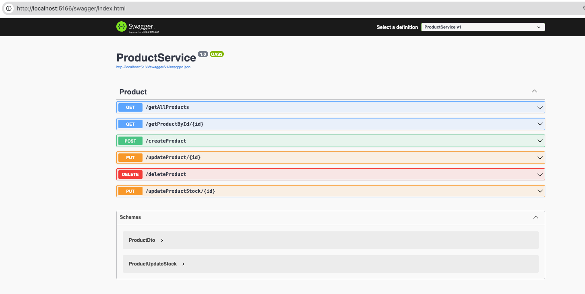

# Crud test backend

Para ejecutar los dos microservicios ir dentro de cada carpeta 
**TransactionService**
**ProductService**

una vez dentro se ejecutan los comandos dotnet run, donde se levantaran cada servicio en difernete puerto


---

## Base de Datos

Se crea la base de datos llamada `testInventory`.

```sql
CREATE DATABASE testInventory;
GO

USE testInventory;
GO


CREATE TABLE [dbo].[Products] (
    [IdProduct]          INT             IDENTITY (1, 1) NOT NULL,
    [NameProduct]        VARCHAR (100)   NULL,
    [DescriptionProduct] VARCHAR (MAX)   NULL,
    [CategoryProduct]    VARCHAR (100)   NULL,
    [ImageProduct]       VARCHAR (MAX)   NULL,
    [PriceProduct]       DECIMAL (18, 2) NULL,
    [StockProduct]       INT             NULL,
    [CreatedAt]          DATETIME        NULL,
    [UpdatedAt]          DATETIME        NULL,
    CONSTRAINT [PK_Produts] PRIMARY KEY CLUSTERED ([IdProduct] ASC)
);


CREATE TABLE [dbo].[Transactions] (
    [IdTransaction]         INT             IDENTITY (1, 1) NOT NULL,
    [IdProduct]             INT             NOT NULL,
    [DetailTransaction]     VARCHAR (MAX)   NULL,
    [QuantityTransaction]   INT             NULL,
    [UnitPriceTransaction]  DECIMAL (18, 2) NULL,
    [TotalPriceTransaction] DECIMAL (18, 2) NULL,
    [TransactionType]       VARCHAR (50)    NULL,
    [CreatedAt]             DATETIME        NULL,
    CONSTRAINT [PK_Transactions] PRIMARY KEY CLUSTERED ([IdTransaction] ASC),
    CONSTRAINT [FK_Transactions_Produts] FOREIGN KEY ([IdProduct]) REFERENCES [dbo].[Products] ([IdProduct])
);


se adjuntan iamgenes del funcionamiento



